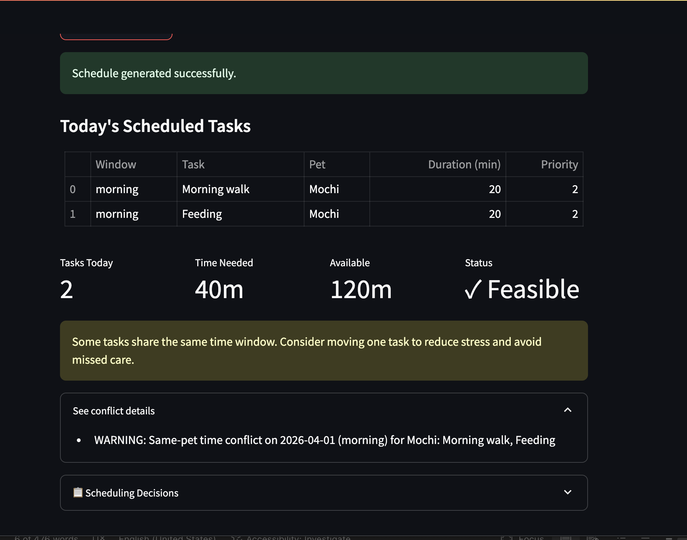

# PawPal+ (Module 2 Project)

You are building **PawPal+**, a Streamlit app that helps a pet owner plan care tasks for their pet.

## Scenario

A busy pet owner needs help staying consistent with pet care. They want an assistant that can:

- Track pet care tasks (walks, feeding, meds, enrichment, grooming, etc.)
- Consider constraints (time available, priority, owner preferences)
- Produce a daily plan and explain why it chose that plan

Your job is to design the system first (UML), then implement the logic in Python, then connect it to the Streamlit UI.

## What you will build

Your final app should:

- Let a user enter basic owner + pet info
- Let a user add/edit tasks (duration + priority at minimum)
- Generate a daily schedule/plan based on constraints and priorities
- Display the plan clearly (and ideally explain the reasoning)
- Include tests for the most important scheduling behaviors

## Getting started

### Setup

```bash
python -m venv .venv
source .venv/bin/activate  # Windows: .venv\Scripts\activate
pip install -r requirements.txt
```

### Suggested workflow

1. Read the scenario carefully and identify requirements and edge cases.
2. Draft a UML diagram (classes, attributes, methods, relationships).
3. Convert UML into Python class stubs (no logic yet).
4. Implement scheduling logic in small increments.
5. Add tests to verify key behaviors.
6. Connect your logic to the Streamlit UI in `app.py`.
7. Refine UML so it matches what you actually built.

## Smarter Scheduling

The scheduler now includes several quality-of-life upgrades:

- Weighted priority scheduling that ranks tasks by priority first, then urgency and time efficiency.
- Task filtering by completion status and pet name for faster schedule review.
- Recurring task automation: when a daily or weekly task is marked complete, a new pending instance is created for the next occurrence.
- Lightweight conflict detection that returns warnings when multiple tasks are assigned to the same date/window (same pet or cross-pet), without crashing the program.
- Next available slot suggestions for unscheduled tasks.
- JSON persistence that saves and reloads owner/pet/task data between app runs.

## Agent Mode Build Notes

Agent Mode was used to plan and implement larger multi-file changes in one workflow pass:

- Added `save_to_json` and `load_from_json` on `Owner` to persist nested `Pet` and `CareTask` objects.
- Updated the Streamlit startup flow in `app.py` to load persisted data automatically from `data.json`.
- Added weighted-priority sorting plus a `suggest_next_available_slot` scheduling capability.
- Applied UI polish (priority/category/status badges, conflict warnings, and suggestion output) so algorithmic behavior is visible to users.

## Testing PawPal+

Run the automated test suite from the project root with:

```bash
python -m pytest
```

Run the Streamlit app:

```bash
streamlit run app.py
```

Current tests cover the most important scheduler behaviors, including:

- Sorting correctness for due and overdue tasks, with deterministic ordering.
- Recurrence logic that creates the next daily/weekly task instance after completion.
- Conflict detection and conflict analysis for duplicate window usage and overload.
- Scheduling allocation behavior, including preferred windows, fallback windows, and unscheduled tasks when time is limited.
- Filtering and de-duplication safeguards for task retrieval and plan generation.

Confidence Level: ★★★★★ (5/5)

Reasoning: The suite currently passes in full (14/14 tests), and it verifies both happy paths and key edge cases for scheduling reliability.

## 📸 Demo

[](course_images/ai110/screenshot.png)
